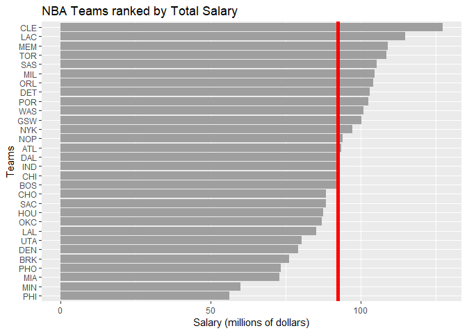
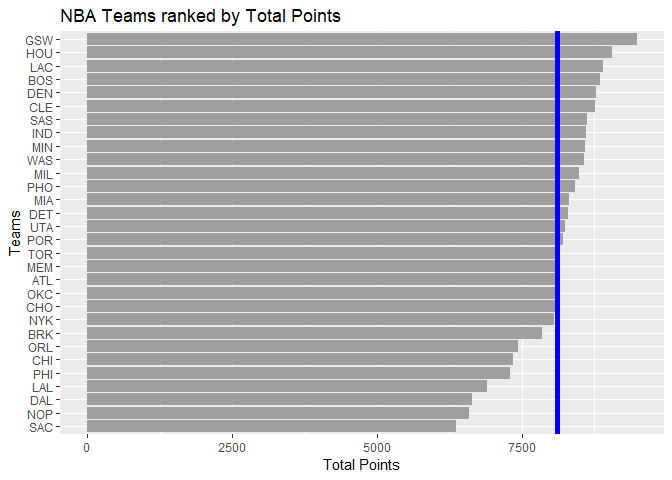
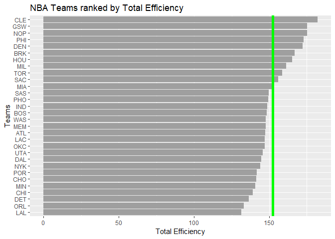
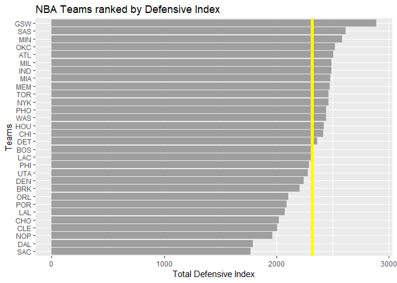

R Notebook
================

``` r
library(dplyr)

setwd('C:/Users/nabki/Desktop/Stat133/workout1/data')
data <- read.csv("nba2018.csv")

data$experience <- as.character(data$experience)
data$experience[data$experience == "R"] = 0
data$experience <- as.integer(data$experience)

data$salary <- data$salary/1000000

levels(data$position) <-  c("center", 
                           "power_fwd", 
                           "point_guard", 
                           "small_fwd", 
                           "shoot_guard")


data <- mutate(data, missed_fg = field_goals_atts - field_goals)
data <- mutate(data, missed_ft = points1_atts - points1)
data <- mutate(data, rebounds = total_rebounds)
data <- mutate(data, efficiency = (points + total_rebounds + assists + steals + blocks - missed_fg - missed_ft - turnovers) / games)

a <- summary(data$efficiency)

getwd()
sink(file = "C:/Users/nabki/Desktop/Stat133/workout1/code/efficiency-summary.txt" )
a
sink()

teams <- summarise(group_by(teams, team),
                   experience = sum(experience),
                   salary = round(sum(salary), 2),
                   points3 = sum(points3),
                   points2 = sum(points2),
                   points1 = sum(points1),
                   points = sum(points),
                   off_rebounds = sum(off_rebounds),
                   def_rebounds = sum(off_rebounds),
                   assists = sum(assists),
                   steals = sum(steals),
                   blocks = sum(blocks),
                   turnovers = sum(turnovers),
                   fouls = sum(fouls),
                   efficiency = sum(efficiency)
)
teams

summary(teams)
write.csv(teams, "../data/nba2018-teams.csv")
sink()
```

``` r
library(ggplot2)
library(dplyr)
```

    ## 
    ## Attaching package: 'dplyr'

    ## The following objects are masked from 'package:stats':
    ## 
    ##     filter, lag

    ## The following objects are masked from 'package:base':
    ## 
    ##     intersect, setdiff, setequal, union

``` r
teams <- read.csv('../data/nba2018-teams.csv')


#Teams by total salary
ggplot(teams, aes(x = reorder(team, salary), y = salary)) + 
  xlab("Teams") +
  ylab("Salary (millions of dollars)") +
  geom_bar(stat='identity', fill = rgb(150,150,150, maxColorValue = 240)) + 
  coord_flip() +
  ggtitle("NBA Teams ranked by Total Salary") +
  geom_hline(yintercept = mean(teams$salary), linetype = "solid", color = 'red', size = 2)
```



``` r
#Teams by points
ggplot(teams, aes(x = reorder(team, points), y = points)) + 
  xlab("Teams") +
  ylab("Total Points") +
  geom_bar(stat='identity', fill = rgb(150,150,150, maxColorValue = 240)) + 
  coord_flip() +
  ggtitle("NBA Teams ranked by Total Points") +
  geom_hline(yintercept = mean(teams$points), linetype = "solid", color = 'blue', size = 2)
```



``` r
#Teams by efficiency
ggplot(teams, aes(x = reorder(team, efficiency), y = efficiency)) + 
  xlab("Teams") +
  ylab("Total Efficiency") +
  geom_bar(stat='identity', fill = rgb(150,150,150, maxColorValue = 240)) + 
  coord_flip() +
  ggtitle("NBA Teams ranked by Total Efficiency") +
  geom_hline(yintercept = mean(teams$efficiency), linetype = "solid", color = 'green', size = 2)
```



``` r
teams = mutate(teams, defense_index = def_rebounds + 2*steals + blocks)
#Teams by custom index
ggplot(teams, aes(x = reorder(team, defense_index ), y = defense_index)) + 
  xlab("Teams") +
  ylab("Total Defensive Index") +
  geom_bar(stat='identity', fill = rgb(150,150,150, maxColorValue = 240)) + 
  coord_flip() +
  ggtitle("NBA Teams ranked by Defensive Index") +
  geom_hline(yintercept = mean(teams$defense_index), linetype = "solid", color = 'yellow', size = 2)
```



``` r
# We all know that defense wins games. So age old adage that the best offense is a good defense was applied to my formula in computing teams ranked by their defensive indexes. I added up defensive rebounds and steals multiplied by two in order to increase the weight that steals play in basketball because of scoring off transition and blocks.
```

Comments and Reflections
========================

**Was this your first time working on a project with such file structure? If yes, how do you feel about it?** We did this in warmups.

**Was this your first time using relative paths? If yes, can you tell why they are important for reproducibility purposes?** We have done this in warmups before.

**Was this your first time using an R script? If yes, what do you think about just writing code (without markdown syntax)?** No it was not my first time using an R script.

**What things were hard, even though you saw them in class/lab?** Pushing the stuff to git was the most difficult part of this assignment.

**What was easy(-ish) even though we haven't done it in class/lab?** Creating the new directories

**Did anyone help you completing the assignment? If so, who?** Yes, I asked my peers on piazza for help

**How much time did it take to complete this HW?** It took about 6 hours to finish this assignment

**What was the most time consuming?** The most time consuming part was setting up github and initializing github on my machine.
